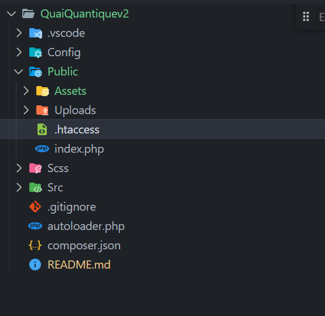
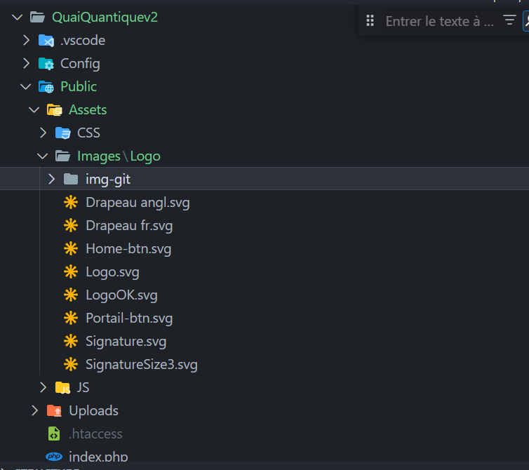

# QuaiQuantiqueV2

## Sommaire
- [Introduction](#introduction)
- [Installation](#installation)
- [Utilisation](#utilisation)
- [Configuration du serveur Apache](#configuration-du-serveur-apache)
- [Information branch en développement](#information-branch-en-développement)
- [Arborescence du projet](#arborescence/info)
- [Contribuer](#contribuer)
- [Licence](#licence)

## Configuration du serveur Apache

Pour que l'application fonctionne correctement sur un serveur Apache, il est nécessaire d'ajouter un fichier `.htaccess` à la racine du dossier `Public`. Ce fichier n'est pas suivi par Git (voir `.gitignore`), donc vous devrez le créer manuellement lors de la mise en place du projet 

### Contenu recommandé pour `.htaccess`

Ajoutez le contenu suivant dans le fichier `.htaccess` : 
RewriteEngine On
RewriteRule ^([a-zA-Z0-9-_/]*)$ index.php?p=$1

Ce contenu active le moteur de réécriture d'URL et définit une règle pour rediriger toutes les requêtes vers le fichier `index.php`, tout en passant le chemin demandé en tant que paramètre `p`. Cela permet à l'application de gérer les URL de manière dynamique.

### Information sur devellopement branch 
Intégration d'un dossier img-git pour integrer les captures d'ecran pour augmenter la comprehension.
Permet d'augmenter et facilité la visualisation dans l arborescence de l'endroit précis où un dossier doit etre creer pour eviter les erreurs futurs lors des merges des differentes branch

### Arborescence du projet
`image pour situer htaccess`

`image pour creation du dossier img-git`

